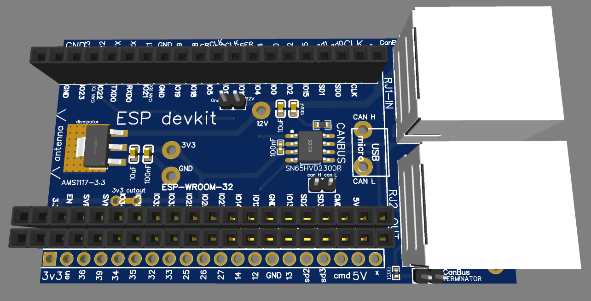

# An ESP32 CanBus shield - made for hoval homevent, but for all canbus applications

[](https://github.com/nliaudat/esp_canbus/wiki)
[](https://github.com/nliaudat/esp_canbus/actions?query=workflow%3ABuild+branch%3Amain)




    
## Functionalities : 
* Compatible with 1000 or 900 mil width ESP devkit
* Full headers for extending or debug
* The card use a ESP32-WROOM-32D as logics and wifi connection. (You can get a 32U if you want an external antenna)
* The software runs under esphome to be easy to customize and linked with https://www.home-assistant.io 
* Power is taken from CanBus 12V and converted to 3.3v with AMS1117-3.3V (not needed but recommended, if cutting the "3v3V cutout", you can use external power supply)
* SN65HVD230 3.3-V CAN Bus Transceivers

## Fabrication : 

* PCB can be ordered with chips assembled at JLPCB for 50$ for 5 boards.
* ESP32-WROOM-32D costs approx 3.8$
* Box is 3D printed or fit in a 86x86 electrical box

## Firmware

<p align="center">
    
    <!--  -->
    <br />
    <i>web interface at http://canbus.local/</i>
</p>

### Features

* Powered by [ESPHome](https://esphome.io/)
* Webserver enabled at [canbus.local](http://canbus.local/)
* Automatically recognized by [Home Assistant](https://www.home-assistant.io/)

### Installation

#### Requirements

Make sure you have Python and ESPHome installed. <br />
To install ESPHome you can follow the [manual installation guide](https://esphome.io/guides/installing_esphome) or use [Docker](https://esphome.io/guides/getting_started_command_line#installation).

You can validate your installation by running

```bash
> esphome version
Version: 2023.11.6
```

#### Firmware configuration

Enter your Wifi SSID and password in `secrets.yaml`.<br />
Then open `config.yaml` and make the following changes:
1. Set `can_tx_pin` and `can_rx_pin`
2. Update the device list. You can find the list of your hoval devices in your room control unit under maintenance. (e.g. `HV(8)` is written as `TT_HV_addr: "8"`)
3. Select your desired presets. All presets are located at [`esphome/src/preset`](https://github.com/nliaudat/esp_canbus/tree/main/esphome/src/preset). <br /> e.g. to select the HV preset in French:

```yaml
packages:
  # ...
  hv_sensors: !include src/preset/HV/sensors_fr.yaml
  hv_inputs: !include src/preset/HV/inputs_fr.yaml
```

If you want to create your own preset or need other datapoints have a look at [`esphome/hoval_data_processing`](https://github.com/nliaudat/esp_canbus/tree/main/esphome/hoval_data_processing)

#### Flash the firmware

Connect your ESP32 via USB to your computer. (Only required for the first time, subsequent installations can be done over WiFi) <br />
Then run `esphome run config.yaml`

## Licence: 
* Creative Commons Attribution-NonCommercial-ShareAlike 4.0 International (CC-BY-NC-SA)
* No commercial use